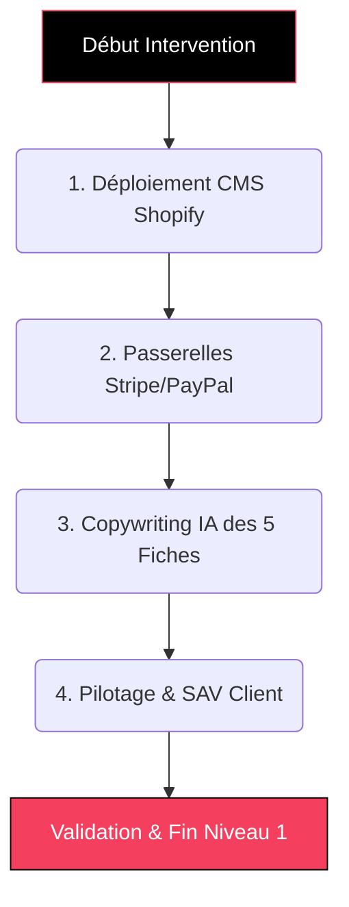
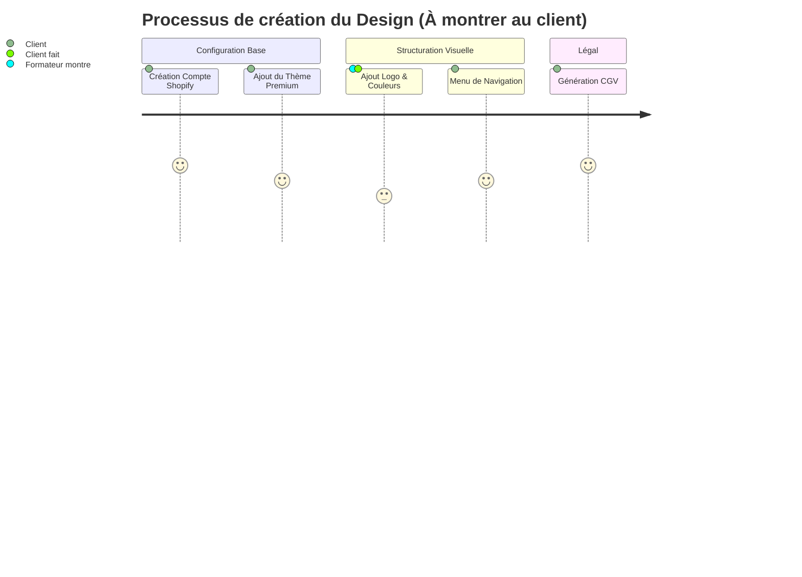
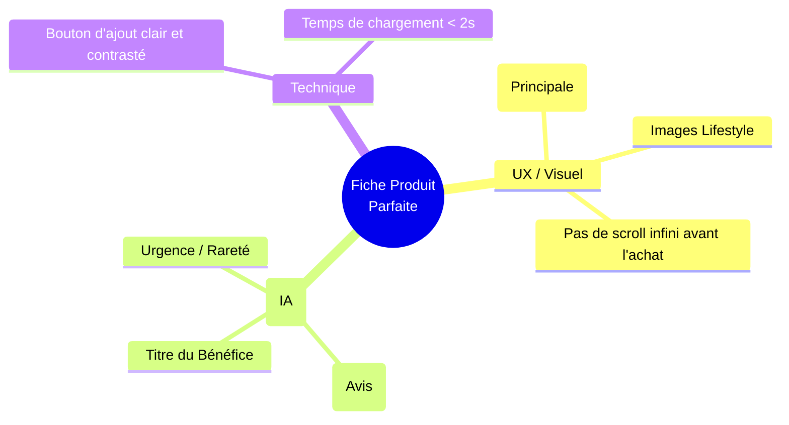

# Guide Formateur : E-COM COMMANDO (Niveau 1 - Launch) 🚀

> **Objectif du document :** Permettre à tout formateur, même sans connaître le programme par cœur, d'animer les sessions "Done-With-You" (On fait avec le client) du Niveau 1 sans bloquage. Suivez simplement les étapes.

---

## 💎 Positionnement "TOP 1% Élite" (Mindset Formateur)
**L'Accroche "Dark Funnel" (Rappel Client) :**
> *"Les agences web classiques vous mentent. Grâce à votre budget OPCO, nous allons encoder ensemble une véritable "Machine à Cash". Mieux encore : vous n'êtes pas seul devant un écran, notre IA et nos experts construisent l'actif EN DIRECT avec vous."*

**L'Équation de Valeur (Hormozi) à transmettre :**
- **Dream Outcome :** Une boutique automatique 24/7.
- **Likelihood of Achievement :** "Done-With-You" (Vous guidez, le client clique) + "Done-For-You" (L'agence livre la technique en coulisses).
- **Time Delay :** Quick Win intégré = Première vente sous 14 jours.
- **Effort & Sacrifice :** Proche de zéro pour le client.

---

## 🎯 Vue d'Ensemble de l'Intervention (Niveau 1)

Ce niveau pose les fondations. À la fin de cette phase, le client doit avoir un site fonctionnel, capable d'encaisser de l'argent de manière sécurisée, avec 5 produits parfaitement optimisés pour vendre.

---

## ÉTAPE 1 : Déploiement du CMS (Shopify) 🏗️

**Temps estimé :** 1h30  
**Objectif Pédagogique :** Le client doit comprendre l'interface globale et son site doit exister juridiquement et visuellement.  
🎓 *Compétence Qualiopi validée : **SKILL ECOM-1 (CMS)***

### Actions du Formateur :
1. **Partage d'écran :** Demandez toujours au client de partager son écran et de manipuler sa souris. Vous le guidez à la voix.
2. **Création du Compte :** Faites lui ouvrir un compte d'essai sur Shopify (Shopify.com/fr).
3. **Thème & Design :**
   - Faites-lui télécharger un thème Premium (ex: Dawn optimisé ou un thème fourni par VOXY).
   - *Directives :* "Cliquez sur 'Boutique en ligne' > 'Thèmes' > 'Ajouter un thème'."
4. **Mentions Légales (CRITIQUE) :**
   - Allez dans Paramètres > Politiques.
   - Générez les politiques types Shopify (Politique de retour, Confidentialité).
   - Expliquez l'obligation légale de ces pages pour éviter les blocages bancaires.

---

## ÉTAPE 2 : Encaissement & Flux Financiers 💳

**Temps estimé :** 45min  
**Objectif Pédagogique :** Le client doit savoir encaisser la carte bancaire via son entreprise.  
🎓 *Compétence transversale (Ingénierie)*

### Actions du Formateur :
1. **Vérification Administrative :** Le client doit avoir son SIRET et l'IBAN de sa société (ou micro-entreprise) à portée de main.
2. **Liaison Stripe :**
   - Allez dans Paramètres > Moyens de paiement > Fournisseurs tiers > Saisissez "Stripe".
   - Expliquez au client : *"Stripe est la banque technologique qui va récupérer l'argent des clients et l'envoyer sur votre compte tous les 3 jours"*.
3. **Liaison PayPal (Optionnel) :** Activez PayPal Express Checkout pour augmenter la conversion de 15%.
4. **Test de commande :** Effectuez ensemble une fausse commande via l'outil "Passerelle de test (Bogus Gateway)".

---

## ÉTAPE 3 : Création de 5 Fiches Produits Massives (IA) ✍️

**Temps estimé :** 2h00  
**Objectif Pédagogique :** Le client apprend à utiliser un Prompt IA (ChatGPT) pour transformer une description produit ennuyeuse en texte hypnotique.  
🎓 *Compétences Qualiopi validées : **SKILL ECOM-4 (Copywriting)** & **SKILL ECOM-2 (Catalogue)***

### Actions du Formateur :
1. **L'Ingénierie du Prompt (Démonstration) :** 
   - Ouvrez ChatGPT.
   - Donnez le prompt type de l'agence au client.
   - *Prompt SEO & Copywriting :* `Agis en tant que Copywriter E-commerce Expert et référenceur SEO (E-E-A-T). Je vends le produit [PRODUIT]. 1. Rédige une liste de mots-clés sémantiques. 2. Écris un Titre H1 ultra-catchy intégrant le mot-clé. 3. Rédige une description structurée en H2/H3 basée sur le framework PAS (Problem-Agitate-Solve). 4. Inclus 3 bénéfices clairs. 5. Génère une balise Meta Description optimisée conversion de 155 caractères.`
2. **La mise en pratique (Les 5 produits) :**
   - Laissez le client copier-coller les résultats dans l'éditeur de produit Shopify.
   - Assurez-vous qu'il structure bien le texte : Titre H1, Sous titres H2 pour aérer, Mots-clés en Gras.
3. **Visuels :** L'importance de la compression d'image (utiliser *TinyPNG* avec le client) pour la vitesse du site.

---

## ÉTAPE 4 : Pilotage Ventes & Logistique 📦

**Temps estimé :** 45min  
**Objectif Pédagogique :** Rassurer le client sur sa capacité à gérer "l'après-vente" : expédier un colis et faire un remboursement.  
🎓 *Compétence Qualiopi validée : **SKILL ECOM-1 (Administration CMS)***

### Actions du Formateur :
1. **Simulation de traitement (Fulfillment) :**
   - Créez une commande manuelle depuis l'interface "Commandes".
   - Faites cliquer le client sur "Traiter la commande" (Fulfill).
   - Expliquez comment entrer le numéro de suivi postal pour que le client final reçoive son mail d'expédition automatique.
2. **Gestion de crise (Remboursement) :**
   - Montrez le bouton rouge "Rembourser".
   - Précisez que rembourser depuis Shopify re-crédite automatiquement la carte du client via Stripe (aucune action bancaire séparée requise).
3. **Clôture :** "Voilà, votre magasin est ouvert, sa caisse est fonctionnelle et vos produits sont en rayon. Vous êtes autonome sur les bases."

---

---

## ⚙️ Prestations "Done-For-You" (Back-office Agence)
*Pendant que vous formez le client, l'agence exécute en coulisse un travail technique massif pour justifier le standard "Top 1% Élite".*

1. **Engineering & Infrastructure :** Paramétrage DNS/CNAME complexe, Audit Core Web Vitals (temps de chargement < 1.8s), intégration Tracking (Pixels/Analytics cachés).
2. **Intégration Charte Graphique Haut de Gamme :** UI/UX Design avancé (variables CSS Boutons CTA "Conversion"), Bannières de réassurance vectorielles, Formatage Mobile Absolu.
3. **Légal :** Validation par un juriste des CGV et Mentions Légales injectées.

*(Fin du Niveau 1. Une fois ces étapes franchies, le client passe au contrat "Performance" s'il est surélevé à l'offre de niveau 2).*
