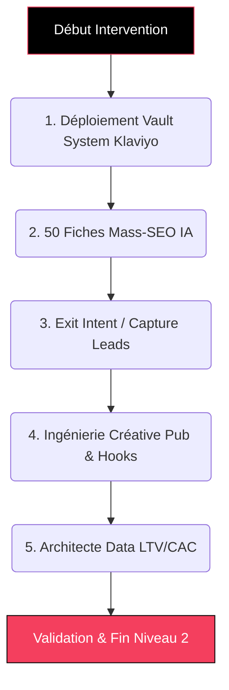

# Guide Formateur : E-COM COMMANDO (Niveau 2 - Performance) 🚀

> **Objectif du document :** Permettre au formateur d'animer les sessions "Done-With-You" du Niveau 2 (Best-Seller) axées sur la Conversion, le SEO en masse et la Rétention.

---

## 💎 Positionnement "TOP 1% Élite" (Mindset Formateur)
**L'Accroche "Dark Funnel" (Rappel Client) :**
> *"Avoir un beau site n'est qu'un socle. L'argent se trouve dans le trafic qui a failli acheter mais qui est parti. Grâce à l'automatisation IA et aux outils des marques à 9 chiffres, nous allons bloquer vos fuites de CA. Et avec notre système SEO de masse, on inonde Google de 50 de vos produits sans lever le petit doigt."*

**L'Équation de Valeur (Hormozi) à transmettre :**
- **Dream Outcome :** Un écosystème de rétention étanche et un trafic organique puissant.
- **Likelihood of Achievement :** "Done-With-You" (Vous expliquez la stratégie) + "Done-For-You" (L'IA et nos scripts font l'injection technique).
- **Time Delay :** CA récupéré endéans quelques heures après la mise en route des paniers abandonnés.
- **Effort & Sacrifice :** Le client encaisse, le robot travaille.

---

## 🎯 Vue d'Ensemble de l'Intervention (Niveau 2)

---

## ÉTAPE 1 : Déploiement du Vault System Anti-Abandon 📨

**Temps estimé :** 1h30  
**Objectif Pédagogique :** Le client comprend comment une séquence mail séquentielle sécurise son chiffre d'affaires.  
🎓 *Compétence Qualiopi validée : **SKILL ECOM-5 (Rétention)***

### Actions du Formateur :
1. **L'Infrastructure Klaviyo :** Faites ouvrir le compte Klaviyo et liez-le à l'intégration (Data Layer) Shopify. 
2. **Séquence Abandon de Panier :** 
   - Montrez l'architecture des 3 e-mails programmés (H+2, J+1, J+2).
   - Formez le client sur la structure psychologique (Rappel doux -> Preuve Sociale -> Urgence/Promo).
3. **Tests de déclenchement :** Exécutez une simulation d'abandon de panier en direct pour vérifier que le flux s'active dans les Dashboard analytiques de l'emailing.

---

## ÉTAPE 2 : Injection de 50 Fiches Mass-SEO (Make.com & IA) 🤖

**Temps estimé :** 1h00  
**Objectif Pédagogique :** Intégrer l'impact de l'IA dans l'architecture SEO et la gestion de catalogue massive.  
🎓 *Compétence Qualiopi validées : **SKILL ECOM-4 (Copywriting)** & **SKILL ECOM-2 (Catalogue)***

### Actions du Formateur :
1. **Démonstration de Batch Processing :** Affichez la feuille de calcul Airtable/Google Sheets maître avec le catalogue du client.
2. **Explication du Script IA :** Montrez comment l'API GPT rédige les 50 balises *Title* et *Meta Description* optimisées longue-traîne.
3. **Le Magic Trick :** Lancez le scénario *Make.com* en direct (Done-For-You technique) et laissez le client actualiser son interface Shopify pour voir les 50 produits s'importer seuls.

---

## ÉTAPE 3 : Capture de Leads via Pop-Up Exit Intent 🧲

**Temps estimé :** 45min  
**Objectif Pédagogique :** Retenir l'attention d'un visiteur sur le départ et enrichir sa base de données CRM.  
🎓 *Compétence Qualiopi validée : **SKILL ECOM-3 (Optimisation - CRO)***

### Actions du Formateur :
1. **Mécanique Comportementale :** Expliquez le fonctionnement du trigger Javascript (la souris qui quitte le haut de la page = déclenchement modal).
2. **Design de L'Offre (Incentive) :** Concevez le contenu de la Pop-up avec le client (Ex: -10% immédiats contre adresse e-mail).
3. **Liaison CRM :** Assurez la connexion pour que tout lead capturé entre dans le "Vault System" (Mail de Bienvenue).

---

## ÉTAPE 4 : Ingénierie de la Créative Publicitaire (Ads) 🎬

**Temps estimé :** 1h00  
**Objectif Pédagogique :** Déconstruire l'anatomie d'une publicité vidéo performante et scénariser un format natif millimétré.  
🎓 *Compétence Qualiopi validée : **SKILL ECOM-4 (Copywriting / Storyboarding)***

### Actions du Formateur :
1. **L'Anatomie du Format "UGC" :** Expliquez la structure exacte d'une publicité qui convertit : Les 3 premières secondes cruciales (Le Hook Visuel + Audio), l'agitation du problème, le déballage natif (Unboxing), et le Call To Action.
2. **Atelier "Scripting Millimétré" :** Scénarisez DIRECTEMENT avec le client la publicité de son meilleur produit (Exemple : "0:00 à 0:03 : Plan serré sur la douleur client avec texte pop-up choc. 0:03 à 0:08 : L'utilisateur sourit en appliquant la solution au format POV...").
3. **Standards de L'Algorithme :** Formez le client aux règles techniques de TikTok/Reels/Meta : Musique "Trending" en fond, rythme ultra-rapide (un changement de plan net toutes les 2 secondes max), et sous-titrages dynamiques animés via application.

---

## ÉTAPE 5 : Tableau de Bord Analytics (Dashboard "God Mode") 📊

**Temps estimé :** 45min  
**Objectif Pédagogique :** Permettre une lecture décisionnelle basée sur la donnée brute et le profit, pas sur l'intuition.  
🎓 *Compétence Qualiopi validée : **SKILL ECOM-6 (Data)***

### Actions du Formateur :
1. **Lecture LTV & CAC :** Formez le client à la lecture simplifiée du Google Data Studio / Shopify Analytics avancé.
2. **Le Traçage Invisible :** Expliquez (sans les perdre techniquement) l'action des pixels Meta et Google Analytics déployés par l'agence.
3. **La Prise de Décision :** Établissez une routine de lecture hebdomadaire pour statuer de la santé financière du magasin E-commerce.

---

## ⚙️ Prestations "Done-For-You" (Back-office Agence)
*Travail technique massif déployé en coulisse par les ingénieurs pour le standard "Performance".*

1. **Ingénierie API / Make.com :** Codage du pipeline d'automatisation reliant Airtable, l'Intelligence Artificielle GPT-4, et la base de données REST API de Shopify pour l'injection SEO instantanée.
2. **Setup DMARC/SPF/DKIM :** Authentification absolue des sous-domaines emails sur les serveurs DNS pour garantir la délivrabilité Klaviyo (0 spam).
3. **Tracking Analytics 4 :** Déploiement dans le "Head" du site des algorithmes de tracking GA4 (Data Layer E-commerce spécifique, Tracking Conversion, Valeur du panier transmise cryptée).

*(Fin du Niveau 2. Le socle de performance est absolu).*
