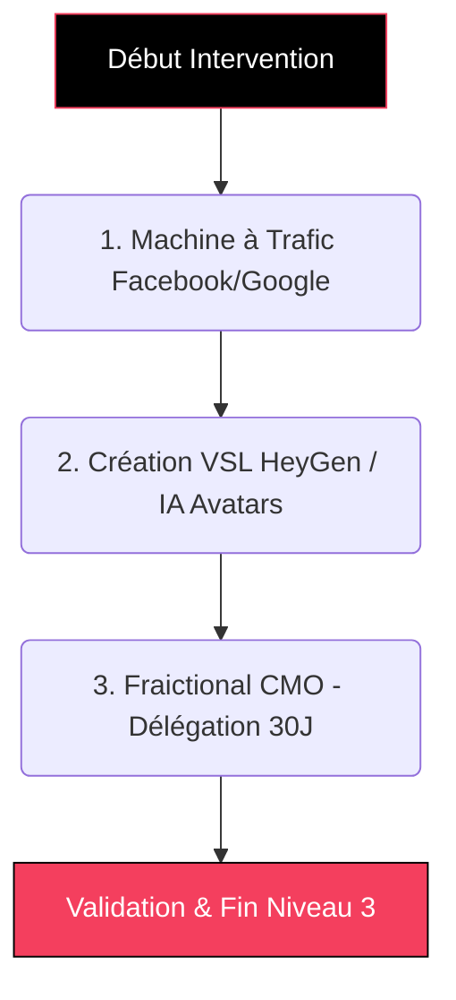

# Guide Formateur : E-COM COMMANDO (Niveau 3 - Empire) 🚀

> **Objectif du document :** Permettre au formateur d'animer les sessions expertes de "Scale" (Niveau 3 - Empire), portées sur l'acquisition algorithmique payante (Ads), la production de vidéos génératives par IA et la délégation Fractional CMO.

---

## 💎 Positionnement "TOP 1% Élite" (Mindset Formateur)
**L'Accroche "Dark Funnel" (Rappel Client) :**
> *"Votre Machine est prête, étanche et optimisée SEO. Il est l'heure d'ouvrir les vannes du trafic payant. Nous n'allons pas vous enseigner à 'booster un post'. Nous allons implémenter des Vidéos VSL générées par Intelligence Artificielle hyper-réaliste, et laisser l'un de nos Directeurs Médias propulser vos campagnes quotidiennes de façon scientifique pendant 30 jours."*

**L'Équation de Valeur (Hormozi) à transmettre :**
- **Dream Outcome :** Acquisition exponentielle agressive (Scale du CA).
- **Likelihood of Achievement :** "Shadowing as a Service" = Le client observe un professionnel (CMO) manoeuvrer avec le budget pendant 30 jours, puis maîtrise la démarche.
- **Time Delay :** Impact immédiat et instantané via Meta Ads/Google Ads.
- **Effort & Sacrifice :** Le client fourni l'investissement publicitaire, et l'Expert gère la technique anti-blocage (CAPI) et l'IA génère les acteurs vidéos.

---

## 🎯 Vue d'Ensemble de l'Intervention (Niveau 3)

---

## ÉTAPE 1 : Machine à Trafic Payant Automatisé (Tutorat) 📈

**Temps estimé :** 2h00  
**Objectif Pédagogique :** Le client comprend les principes mathématiques de Meta/Google Ads.  
🎓 *Compétence Qualiopi validée : **SKILL ECOM-6 (Data)** ou ECOM-3 (CRO)*

### Actions du Formateur :
1. **Ouverture du Business Manager :** Guidez le client sur ses actifs Meta (Pages, Ad Account sécurisé).
2. **Stratégie d'Acquisition :** Expliquez la différence vitale entre l'Audience Broad (Large), le Lookalike (Similaires), et le DPA de retargeting produit.
3. **Tracking CAPI avancé :** Expliquez comment la liaison directe serveur à serveur (Conversion API) est le seul moyen de contourner les blocus Apple/IOS 14, garantissant la fiabilité des coûts par vente.

---

## ÉTAPE 2 : VSL (Video Sales Letter) via HeyGen (Clônage IA) 🤖🎥

**Temps estimé :** 1h30  
**Objectif Pédagogique :** S'affranchir du coût exorbitant des acteurs UGC humains par la génération neuronale.  
🎓 *Compétence Qualiopi validée : **SKILL ECOM-4 (Copywriting / Scripting)** & Outils Visu*

### Actions du Formateur :
1. **L'Architecte Vidéo IA :** Ouvrez HeyGen/ElevenLabs. Saisissez le script publicitaire accrocheur et choisissez l'Avatar Digital ou synthétisez la voix du client.
2. **Framework "Direct Response" :** Faites rédiger par l'I.A. (ChatGPT) le Script idéal en 3 actes : le *Hook* (Capter les 3 premières secondes), *Agitation & Solution*, et le puissant *Call to Action*.
3. **Format Short & B-Roll :** Apprenez la logique du format vertical TikTok/Reels dynamique avec l'insertion de sous-titres animés continus.

---

## ÉTAPE 3 : Fractional CMO (Shadowing en direct) 💼

**Temps estimé :** 30 Jours (Répartition par tranches horaires)  
**Objectif Pédagogique :** Transfert de compétence passif par observation de la maîtrise de l'expert Média Buyer.  
🎓 *Compétence transversale (Ingénierie Masterclass)*

### Actions du Formateur :
1. **Lancement de l'Autopilote :** Le Media Buyer Agence prend le compte en main.
2. **L'A/B Testing en coulisses :** L'expert alloue les poches de micro-budget sur divers visuels produits pour baisser radicalement le CPA d'acquisition.
3. **Shadowing Hebo :** 1h par semaine, le trafic manager montre au client les ajustements ("Scale" d'un budget gagnant, "Cut" automatique des publicités perdantes).
4. **Passation (Off-boarding) :** À un mois (J+30), transfert parfait du "Tableau d'Aviation" au client avec recommandation du budget quotidien standardisé.

---

## ⚙️ Prestations "Done-For-You" (Back-office Agence)
*Travail massif d'expertise publicitaire.*

1. **Ingénierie Cloud (CAPI) :** Implémentation en dur de la Meta Conversion API via Token HTTPS.
2. **Montage Publicitaire Dynamique :** Utilisation d'éditeurs avancés (CapCut Pro / IA Automatisés) pour coller au standard Short/UGC moderne avec musiques "Trending".
3. **Gestion Journalière du Capital Investi :** Protocole humain d'optimisation (ROAS/CPA) appliqué tous les matins par l'agence.

*(Fin de l'Ingénierie Ultime du Niveau 3).*
