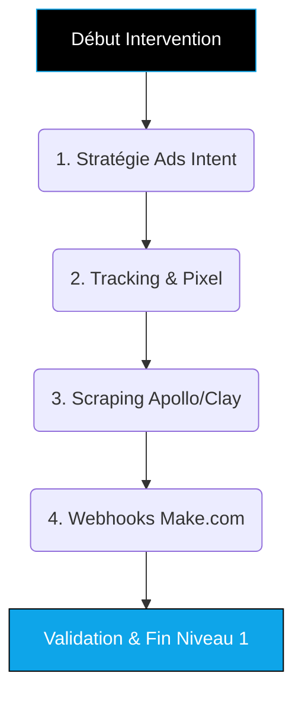
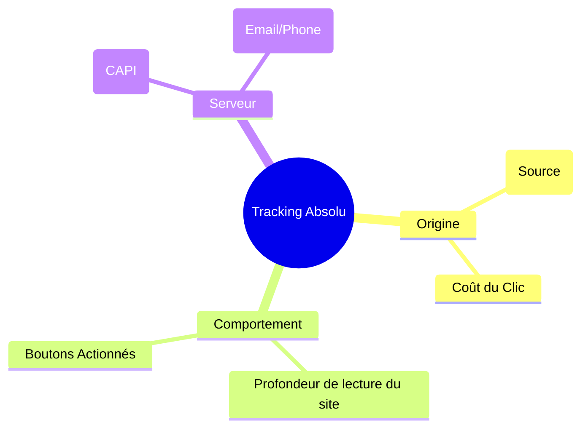
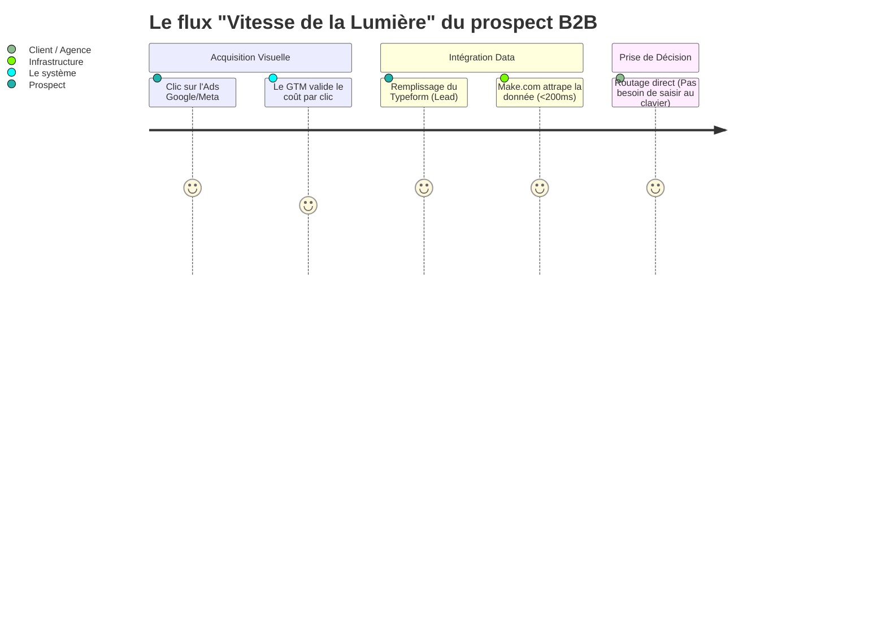

# Guide Formateur : OUTBOUND HYBRIDE (Niveau 1 - Launch) 🚀

> **Objectif du document :** Permettre au formateur de paramétrer l'architecture asynchrone d'acquisition de leads en mode "Done-With-You". Les tuyaux (Acquisition -> Extraction -> Webhooks) doivent être raccordés techniquement pendant que le client comprend la matrice.

---

## 💎 Positionnement "TOP 1% Élite" (Mindset Formateur)
**L'Accroche "Machine à Prospection" (Rappel Client) :**
> *"Oubliez les appels à froid humiliants et l'espoir d'attendre un prospect. Grâce à votre budget OPCO, nous allons brancher un réacteur sur votre entreprise. Les gens qui ont un besoin brûlant aujourd'hui vont tomber dans votre base de données, et l'IA s'occupera d'eux avant qu'ils n'aient le temps d'ouvrir le site de votre concurrent."*

**L'Équation de Valeur (Hormozi) à transmettre :**
- **Dream Outcome :** Un flux prédictible de rendez-vous B2B exclusifs chaque semaine.
- **Likelihood of Achievement :** Les algorithmes mathématiques (Google Intent, Apollo) sont infaillibles, contrairement au démarchage "à l'instinct".
- **Time Delay :** Immédiat = Lancement des Ads à J+1 = Premier Lead le jour même.
- **Effort & Sacrifice :** Zéro effort de qualification manuelle pour le client (l'ingénierie Make le fait pour lui).

---

## 🎯 Vue d'Ensemble de l'Intervention (Niveau 1)

Ce niveau architecture l'entrée du Funnel. Fin de Niveau 1, le client possède ses campagnes d'Ads prêtes à capter la demande tiède, l'infrastructure de tracking valide les actions, sa base de données prospect est scrapée, et l'architecture "Webhook" est prête à propulser n'importe quel lead vers l'IA (qui sera traitée au Niveau 2).

---

## ÉTAPE 1 : Stratégie d'Acquisition Intentionniste 🎯

**Temps estimé :** 1h00  
**Objectif Pédagogique :** Le client paramètre la captation mathématique de "l'Intention de recherche" et non pas la promotion classique.  
🎓 *Compétence Qualiopi validée : **SKILL OUTBOUND-1 (Acquisition)***

### Actions du Formateur :
1. **Partage d'écran :** Demandez toujours au client de partager son écran et de cliquer lui-même dans le Business Manager.
2. **Architecture du Compte :**
   - Validez l'ouverture du Google Ads Manager et Meta Business.
   - Forcez la facturation validée.
3. **Recherche Sémantique B2B :**
   - Utilisez Google Keyword Planner avec le client.
   - Filtrez uniquement sur les requêtes avec un niveau de chaleur "Tiède / Chaud" (ex: "Prestation nettoyage locaux Lyon" vs "Comment faire du nettoyage").
4. **Bidding & Exclusion :**
   - Configurez une enchère "Maximize Conversions / Target CPA".
   - *Directives Exclusives :* Faites lui ajouter manuellement les mots "gratuit", "pas cher", "emploi" en mots-clés à exclure pour économiser 20% du budget instantanément.

---

## ÉTAPE 2 : Ingénierie de Tracking & Pixel 📡

**Temps estimé :** 45min  
**Objectif Pédagogique :** Le client doit comprendre analytiquement d'où viennent ses clients.  
🎓 *Compétence transversale (Ingénierie)*

### Actions du Formateur :
1. **Conteneur GTM :**
   - Activez ensemble le Google Tag Manager.
   - *Langage commun : "GTM c'est la multiprise électrique de votre site web, sur laquelle on branchera tous les autres outils sans toucher au code."*
2. **Conversion API (CAPI) :**
   - Lancez le paramétrage "Serveur-side" (réalisé en grande partie de notre côté en Mode Phantom).
3. **Trigger d'évènement clé :**
   - Demandez au client de vous montrer où un visiteur remplit ses informations (Ex : Clic sur bouton Calendly ou Typeform).
   - Simulez l'action pour vérifier que l'évènement "Lead" s'allume bien en vert dans le tag manager.

---

## ÉTAPE 3 : Extraction Data B2B (Apollo & Clay) 🗄️

**Temps estimé :** 1h00  
**Objectif Pédagogique :** Savoir capturer intentionnellement la base de données de son marché cible, le "Sourcing Froid".  
🎓 *Compétence Qualiopi validée : **SKILL OUTBOUND-2 (Scraping & Enrichissement)***

### Actions du Formateur :
1. **La Matrice Persona (ICP) :**
   - Ouvrez Apollo.io.
   - *Directives directes :* Prenez un cas concret. Cherchez avec lui par Titre (Ex: "Directeur de restaurant"), Taille de l'entreprise (ex: "10-50 salariés"), et Technologie (ex: "Utilise Shopify").
2. **Enrichissement Waterfall (Clay.com) :**
   - Exportez la liste brute.
   - Injectez-la dans Clay.
   - Montrez la "cascade de vérification" (Waterfall) : Le logiciel cherche l'email via Hunter, s'il échoue, il tente via Prospeo, etc., jusqu'à réussir.
   - Objectif final : Obtenir un fichier Excel avec un taux de "Valid Email" / "Valid Phone" de 100%.

---

## ÉTAPE 4 : Vélocité Absolue (Webhooks Make.com) ⚡

**Temps estimé :** 45min  
**Objectif Pédagogique :** Transmettre un prospect froid ou tiède à la machine finale en moins d'une seconde de délai.  
🎓 *Compétence Qualiopi validée : **SKILL OUTBOUND-3 (Automatisation No-Code)***

### Actions du Formateur :
1. **Architecture No-code :**
   - Ouvrez un compte commun sur Make.com face au client.
2. **Le Scénario (Routeur) :**
   - Créez un Webhook Custom et connectez-le au formulaire du site internet.
   - *Directive :* Remplissez avec le client une réponse de test (Prénom : Test / Téléphone : 060000). Vous devez observer le "flash vert" dans le routeur de Make.
3. **Conditions (Filters) :**
   - Connectez la route vers Slack ou le CRM.
   - Appliquez un filtre : Ne laisser passer que les prospects ayant coché "Budget > 5000€".
4. **Clôture du Niveau 1 :** 
   *"Félicitations, l'autoroute technologique est construite et asphaltée. Au prochain module (Niveau 2), nous positionnerons le robot Vapi au bout de la route pour accueillir vos prospects."*

---

## ⚙️ Prestations "Done-For-You" (Back-office Agence)
*Pendant que vous formez le client au front-end abstrait, l'agence exécute l'infrastructure complexe.*

1. **Intégration Conversion API (CAPI) :** Poser les clés secrètes serveur dans Google Tag Manager.
2. **Chauffage de Domaine (Emailing Cold) :** Paramétrage DNS (SPF, DKIM, DMARC) du domaine de prospection pour certifier l'envoi des mails.
3. **Validation Code :** Test complet du webhook Make par l'équipe d'ingénierie et garantie 100% de fiabilité ("Always-On Server").

*(Fin du Niveau 1 - Le client a paramétré la mécanique qui le prépare à l'Agent IA)*
