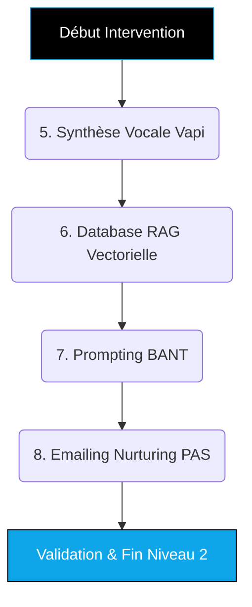
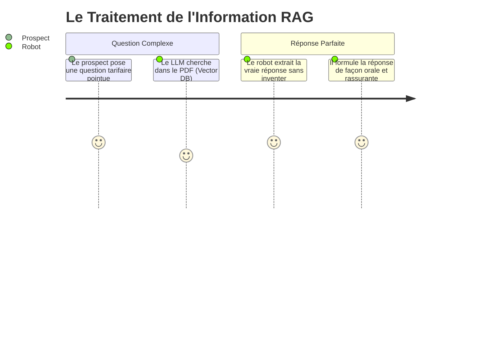

# Guide Formateur : OUTBOUND HYBRIDE (Niveau 2 - Performance) 🚀

> **Objectif du document :** Permettre au formateur d'animer les sessions "Done-With-You" du Niveau 2 (Best-Seller). Ce module est le cœur du réacteur : vous allez connecter et éduquer l'Intelligence Artificielle Vocale pour qu'elle remplace le commercial humain dans la qualification.

---

## 💎 Positionnement "TOP 1% Élite" (Mindset Formateur)
**L'Accroche "Vendeur Synthétique" (Rappel Client) :**
> *"Le secret des startups à très forte croissance n'est pas d'embaucher une armée de commerciaux stagiaires. Nous allons concevoir ensemble le parfait employé de qualification : une Intelligence Artificielle qui connaît tout de votre entreprise, appelle vos leads en moins d'une seconde, analyse leurs besoins avec une empathie simulée parfaite, et vous donne les meilleurs rendez-vous. Le tout sans salaire ni congé."*

**L'Équation de Valeur (Hormozi) à transmettre :**
- **Dream Outcome :** Une équipe de vente virtuelle qui qualifie automatiquement 24/7 de manière hyper-réaliste.
- **Likelihood of Achievement :** "Done-With-You" (On choisit les prompts) + "Done-For-You" (L'agence gère la programmation LLM, les limites de token et la base vectorielle).
- **Time Delay :** Résultat dès le premier clic généré au Niveau 1 (Appel en temps réel).
- **Effort & Sacrifice :** Le client ne fait plus aucun appel de prospection inutile. Il ne parle qu'aux "Gros Poissons".

---

## 🎯 Vue d'Ensemble de l'Intervention (Niveau 2)



---

## ÉTAPE 5 : Programmation de la Voix IA (Vapi) 🎙️

**Temps estimé :** 1h00  
**Objectif Pédagogique :** Paramétrer la personnalité acoustique du robot pour supprimer l'effet "Vallée Dérangeante".  
🎓 *Compétence Qualiopi validée : **SKILL OUTBOUND-4 (Acoustique / SSML)***

### Actions du Formateur :
1. **Initialisation de l'Agent :**
   - Ouvrez l'interface Vapi / Bland AI.
   - Demandez au client de choisir le modèle de voix (Cartographie des timbres "Confiance", "Jeune & Dynamique", "Sénior rassurant").
2. **SSML (Speech Synthesis Markup Language) :**
   - Formez le client sur l'illusion humaine de base.
   - *Directives directes :* Demandez au client de paramétrer des bruits de "hmm", de faux cliquetis de clavier en fond et des respirations au sein de la ligne de texte de démarrage ("Filler words").
3. **Latence Serveur :**
   - Expliquez le ciblage "Low Latency" (< 800ms).
   - "Un humain sent un malaise si le robot met 2 secondes à répondre à un 'Bonjour'."

---

## ÉTAPE 6 : Injection de Base de Connaissances (Vector DB & RAG) 🧠

**Temps estimé :** 1h00  
**Objectif Pédagogique :** Éduquer l'IA pour qu'elle puisse répondre à toutes les questions techniques sur l'entreprise du client sans jamais mentir (Gérer le phénomène d'Hallucination).  
🎓 *Compétence Qualiopi validée : **SKILL OUTBOUND-5 (Machine Learning Contextuel)***

### Actions du Formateur :
1. **Matière première :** Collectez en direct avec lui les documents PDF de l'entreprise (FAQ, Liste des Tarifs, Conditions, Avantages concurrentiels).
2. **Le Scraping Interne :** Upload de la base documentaire dans la zone Knowledge de l'Agent.
3. **Guardrails (Garde-fous) :**
   - Intégrez la notion de Grounding avec le client.
   - *Phrase Clé : "Si on vous pose une question hors du contexte fourni, répondez toujours : 'C'est une excellente question, je n'ai pas la donnée sous les yeux mais je vais demander à Sébastien de vous répondre lors de votre visio ensemble'."*



---

## ÉTAPE 7 : L'Appel Intentionnel (Master Prompting) 💬

**Temps estimé :** 1h30  
**Objectif Pédagogique :** Définir le "Script" (Prompt Sys) que l'IA va suivre aveuglément pour éliminer les mauvais clients et garder les bons.  
🎓 *Compétence Qualiopi validée : **SKILL OUTBOUND-6 (Prompt Engineering)***

### Actions du Formateur :
1. **La Matrice B.A.N.T (Budget, Authority, Need, Timing) :**
   - Paramétrez le comportement de l'IA. Elle a l'ordre absolu de ne relâcher l'appel que si elle a validé ces 4 points.
2. **Directives Temporelles :**
   - L'IA doit être courte et laisser parler. Injectez la règle : *"Tes réponses ne doivent jamais excéder 3 phrases."*
3. **Le Test de Feu (Live Test) :**
   - *CRUCIAL :* Donnez le numéro généré de l'IA au client et dites-lui d'appeler l'IA depuis son smartphone en visio.
   - Demandez-lui de jouer le pire prospect possible (Objections du type : "Je suis pressé", "C'est cher").
   - Analysez l'adaptation de l'IA en direct avec lui.

---

## ÉTAPE 8 : Pré-Cadre Nurturing Silencieux (Emailing PAS) 📨

**Temps estimé :** 45min  
**Objectif Pédagogique :** Assurer le "rebond" des 50% de prospects qui n'auront pas décroché face au robot.  
🎓 *Compétence Qualiopi validée : **SKILL OUTBOUND-7 (Copywriting)***

### Actions du Formateur :
1. **Séquence "Ghosted" :**
   - Ouvrez l'outil d'Emailing Automatique.
   - Expliquez que si l'API détecte le statut "Voicemail", elle déclenche une séquence différée.
2. **Structure Email (Framework PAS) :**
   - Transmettez le Prompt "Problem-Agitate-Solve" au client.
   - Demandez-lui de générer les 3 e-mails éducatifs (Un mail axé sur la Douleur, un sur la Preuve Sociale, un sur la Vidéo de Démo).
   - *Langage commun : "Si le prospect ne décroche pas, on ne l'abandonne pas. La machine va lui envoyer du contenu tellement passionnant qu'il aura envie de répondre à notre appel 2 jours plus tard."*

```mermaid
mindmap
  root((Séquence 
  Nurturing))
    Déclencheur
      Appel manqué
      Statut = Voicemail
    Jour 1
      Cibler la Douleur Majeure (P)
    Jour 2
      Agiter la conséquence (A) + Case Study
    Jour 3
      Solution ultime (S) + Nouveau déclenchement appel
```

---

## ⚙️ Prestations "Done-For-You" (Back-office Agence)
*Travail technique complexe rendu invisible pour garantir un standard Élite lors du Niveau 2.*

1. **Ingénierie VoIP (Serveur Téléphonique) :** Achat de numéros virtuels Twilio/Telnyx avec score de réputation "High Trust" pour éviter de tomber automatiquement en SPAM.
2. **Configuration Vectorielle Sécurisée :** Nettoyage des données du client, tokenisation via modèle d'Embedding (OpenAI) et implémentation dans Pinecone/Weaviate pour la récupération de contexte (RAG).
3. **Délivrabilité Messagerie Complète :** Chauffage Serveur et installation des certificats DMARC/DKIM/SPF sur les domaines alternatifs afin de garantir une rentrée des e-mails en boîte principale (Inbox Placement > 95%).

*(Fin du Niveau 2. L'intelligence artificielle est programmée, éduquée au métier du client, et branchée.)*
