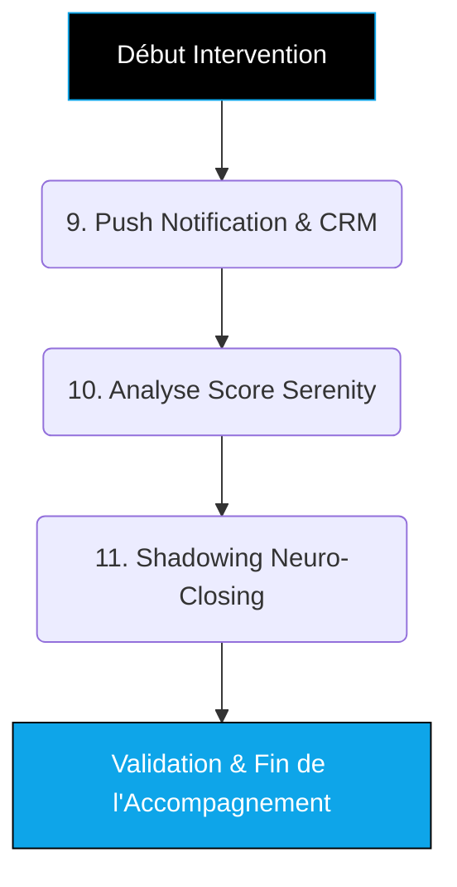
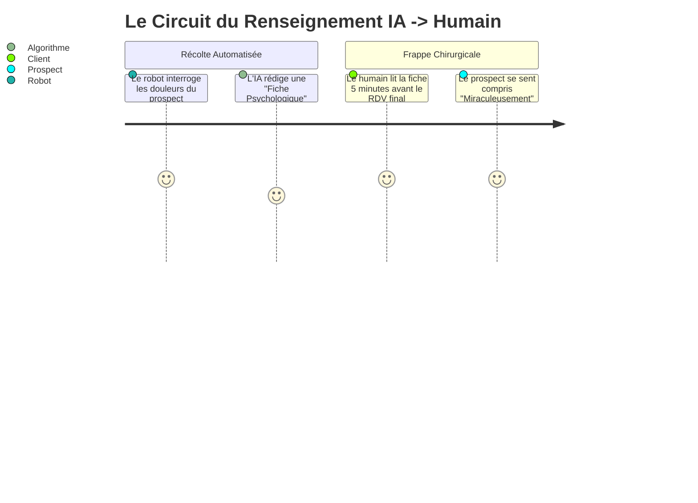

# Guide Formateur : OUTBOUND HYBRIDE (Niveau 3 - Empire) 🚀

> **Objectif du document :** Permettre au formateur d'animer les sessions expertes de "Scale" (Niveau 3 - Empire), portées sur la synchronisation des données CRM en direct, l'analyse prédictive du Score Serenity, et le transfert de compétences en Neuro-Closing.

---

## 💎 Positionnement "TOP 1% Élite" (Mindset Formateur)
**L'Accroche "Délégation Absolue" (Rappel Client) :**
> *"L'Intelligence Artificielle vous trouve des clients, mais c'est l'Intelligence Humaine qui signe les contrats. Nous allons fusionner la machine avec votre agenda. À chaque prospect qualifié par le robot, votre système CRM va s'illuminer, et vous y trouverez une analyse psychologique complète du prospect avant même de lui parler. Vous n'aurez plus qu'à "cueillir" avec nos méthodes de neuro-vente."*

**L'Équation de Valeur (Hormozi) à transmettre :**
- **Dream Outcome :** Un taux de closing (signature) doublé sans augmenter le volume d'appels manuels.
- **Likelihood of Achievement :** "Shadowing as a Service" = Entraînement en direct aux scripts de closing avancés de l'Agence.
- **Time Delay :** Signature du premier contrat post-IA dans les jours qui suivent l'activation.
- **Effort & Sacrifice :** Plus aucune saisie manuelle de données, le CRM se remplit tout seul et le commercial est guidé par l'algorithme.

---

## 🎯 Vue d'Ensemble de l'Intervention (Niveau 3)

---

## ÉTAPE 9 : Routage CRM & Alerting "Push" 🔔

**Temps estimé :** 1h00  
**Objectif Pédagogique :** Éliminer la friction administrative de la saisie de prospects et augmenter l'adrénaline de la force de vente via des notifications instantanées.  
🎓 *Compétence Qualiopi validée : **SKILL OUTBOUND-8 (Systématisation)***

### Actions du Formateur :
1. **Liaison Bidirectionnelle :**
   - Connectez l'API de Pipedrive, HubSpot ou GoHighLevel.
   - Demandez au client de créer avec vous la colonne "Lead Chaud (Généré par IA)".
2. **Notification Instantanée (Le bruit de l'argent) :**
   - Ouvrez Make.com.
   - Connectez un module "Slack" ou "Discord" pour envoyer une notification Push sur le téléphone du client à chaque RDV pris par l'IA.
   - *Test psychologique :* Déclenchez une fausse notification en visio. *"Entendez-vous ce son ? C'est le bruit d'une opportunité financière qualifiée par la machine pendant que vous étiez sur autre chose."*

---

## ÉTAPE 10 : Data Analytics & Lecture du "Score Serenity" 📊

**Temps estimé :** 1h00  
**Objectif Pédagogique :** Former le commercial humain à lire "à travers" l'analyse de l'IA pour utiliser les douleurs du prospect comme levier de closing.  
🎓 *Compétence Qualiopi validée : **SKILL OUTBOUND-9 (Data Intelligence)***

### Actions du Formateur :
1. **L'Anatomie du Transcript :**
   - Affichez un compte-rendu post-appel réel généré par Vapi/Bland AI.
   - Montrez la différence entre la "Transcription littérale" (ce qu'ils ont dit) et le "Summary" (l'analyse synthétique des intentions).
2. **Explication de l'Indice de Décision (Score Serenity) :**
   - L'IA note le lead de 1 à 100 sur trois critères : L'urgence, l'autorité financière, et le niveau de frustration actuel.
   - *Directives directes :* Formez le client à *"Lire ce score avant la visio Google Meet pour savoir s'il faut attaquer le RDV en mode Empathique (si la frustration est haute) ou en mode Autoritaire (si l'autorité est basse)."*

---

## ÉTAPE 11 : Transition Symbiotique & Neuro-Closing (Shadowing) 🤝

**Temps estimé :** 2h00  
**Objectif Pédagogique :** Assurer que le trafic ultra-froid transformé en trafic tiède par l'IA se transforme réellement en argent.  
🎓 *Compétence transversale (Ingénierie Masterclass)*

### Actions du Formateur :
1. **Le "Hand-Off" :**
   - Transmettez le Script de lancement de visio.
   - *Langage commun : "Ne dites jamais 'Mon robot vous a eu au téléphone', dites toujours 'J'ai écouté l'excellent rapport que m'a fait mon assistant concernant votre situation...'."*
2. **Jeu de Rôle Clinique :**
   - Traitement des Objections en direct. Le client joue son rôle, vous jouez le prospect difficile (Désamorçage des faux-fuyants typiques).
3. **Passation (Off-boarding) :**
   - Remise des "Clés de la Machine".
   - Le client détient les mots de passe de Make, de Vapi, et sait relancer ou mettre en pause ses campagnes d'Acquisition.

---

## ⚙️ Prestations "Done-For-You" (Back-office Agence)
*Le travail silencieux de notre ingénierie pour fluidifier le "Scale".*

1. **Architecture Sécurisée des Flux :** Déploiement en "backend" d'un middleware (tampon) évitant que les limites de taux (Rate Limits) des APIs CRM ne crashent lors d'afflux massifs de leads.
2. **Custom Prompts Evaluators :** C'est l'agence qui maintient et perfectionne en fond (Shadowing technique direct) les algorithmes secrets du "Score Serenity" (via des LLMs secondaires qui évaluent la pertinence du premier LLM appelé "Self-Reflection").
3. **Maintien des Serveurs ("Uptime") :** Monitoring à 99,99% pour garantir que la machine de prospection ne s'endorme jamais.

*(Fin de l'Ingénierie Ultime du Niveau 3).*
