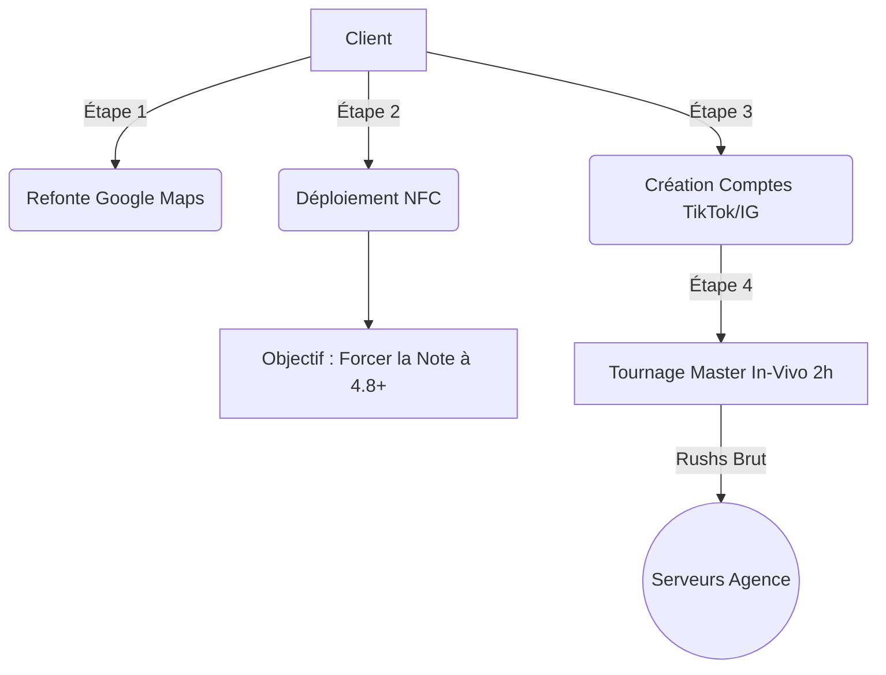

# Guide Formateur : DRIVE-TO-STORE VIRALE (Launch)
**Niveau 1 : Les Fondations (Référencement, Écosystème & Captation In-Vivo)**

> [!IMPORTANT] 
> **DIRECTIVE TOP 1% :** Le client d'une offre Drive-To-Store n'a qu'un seul objectif : remplir son établissement physique (Restaurant, Clinique, Cabinet). Il n'a que faire des "likes". Ce module de fondation (Launch) est critique pour implanter la logistique absolue qui convertira plus tard les vues en trafic piéton. Focus sur l'ingénierie Google Maps, la notation poussée et la récolte des vidéos (Rushs).

## Logistique de Captation "Viralité" (Flux)

---

## ÉTAPE 1 : Audit SEO Local & Google Maps
*Durée: 1h00 | Valide : SKILL D2S-1*

**Actions Directives :**
- **Désincarcération du Compte :** Assurez-vous que le gérant possède toutes les clés administrateurs de sa propre fiche Google My Business.
- **Audit Sémantique & Catégorisation :** Revoyez la "description" pour intégrer les requêtes vocales (Ex: "Où manger les meilleures pâtes autour de moi à Paris"). Renseignez jusqu'à 5 catégories secondaires.
- **Le Hack "EXIF" :** Formez le client à ne plus jamais uploader de photos "classiques" sur sa fiche, mais d'utiliser des photos dont les métadonnées géotaggées correspondent exactement à son établissement.

> [!TIP]
> **Angle Vente & Rétention :** "Tirer des milliers de vues sur TikTok c'est drôle, mais si le prospect tape votre nom sur Google ensuite, et voit 3,2 étoiles avec des photos sombres, il ira chez le voisin. On répare le tiroir-caisse d'abord."

---

## ÉTAPE 2 : Déploiement du "Local Trust Engine" (NFC)
*Durée: 45min | Valide : SKILL D2S-2*

**Actions Directives :**
- **Liaison Matérielle NFC :** Opérez devant le client le paramétrage de la technologie Sans-Contact des plaques physiques avec le lien exact de sa fiche GMB.
- **Processus d'Interception du Staff :** Entraînez le client à sortir la "phrase magique" au comptoir : *"Si vous avez passé un bon moment, ça m'aiderait beaucoup si vous approchiez votre téléphone d'ici juste une seconde."*

---

## ÉTAPE 3 : Écosystème Vidéo Algorithmique
*Durée: 45min | Valide : SKILL D2S-3*

**Actions Directives :**
- **Standardisation "Business" :** Passez obligatoirement les profils Instagram et TikTok en "Mode Professionnel" pour accéder aux métriques.
- **Ingénierie de la Bio :** Rédigez une biographie avec l'architecture : (1) Autorité, (2) Emplacement direct, (3) CTA vers outil de réservation.
- **L'URL Parfaite :** Installez un agrégateur de liens propre (Linktree ou page dédiée).

---

## ÉTAPE 4 : Atelier Mise en Scène & Tournage 2h (In-Vivo)
*Durée: 2h30 (Sur site) | Valide : SKILL D2S-4*

**Actions Directives :**
- **Démystification Caméra :** Apprenez au client que l'audience de consommation sociale veut du réel et de l'authentique.
- **Tournage Actif :** L'Expert filme avec son équipement (Stabilisateur DJI, Micros Sans-fil). Poser des questions incisives.
- **Banque B-Roll :** Assurez-vous de capturer 60% d'images d'illustration (le produit fumant, l'équipe, la caisse).

> [!TIP]
> **Angle Vente & Rétention :** "Ne réfléchissez pas, soyez vous-même. Je gère l'image et le son. Dans notre usine de montage (Tier 2), on coupera les hésitations."

---

## Ce que comprend la formation (Détail point par point)
*Récapitulatif contractuel des livrables techniques et pédagogiques à l'issue de l'intervention de niveau 1.*

- **Base Sémantique & Géographique (GMB) :** Audit initial et récupération de la propriété de la Fiche Google. Refonte sémantique des descriptions. Processus de réponse IA aux avis. Méthodologie d'encodage EXIF pour la géolocalisation des photos HD.
- **Local Trust Engine (Machine à Avis) :** Infrastructure NFC déployée en point de vente ou flyers d'interception. Système psychologique de déviation des retours négatifs. Protocoles d'éléments de langage pour le Staff de caisse.
- **Écosystème Vidéo de Marque :** Configurations officielles "Business" sur Meta/Instagram et TikTok. Copywriting neuro-scientifique des biographies. Architecture des liens de conversion.
- **Production In-Vivo "Top 1%" :** Coaching en expression physique et orale (visual hooks). Set-up professionnel sur place. Tournage de 2h de matériel brut. Constitution d'une banque d'images B-Roll.

---

## Prestations "Done-For-You" (Back-Office Ingénierie)
*Les actions déléguées 100% au centre de formation, opérées en coulisses.*

- **Engineering Système Local :** Fabrication d'Assets (Encodage manuel des puces NFC). Désinfection E-Réputation (Action de "Flag" massive sur les anciens avis illégitimes Google).
- **Traitement Brut In-Vivo :** Synchro Auditive (Nettoyage logiciel des bruits ambiants Adobe Podcast). Ingestion Cloud sécurisée pour les serveurs de traitement asynchrones.
