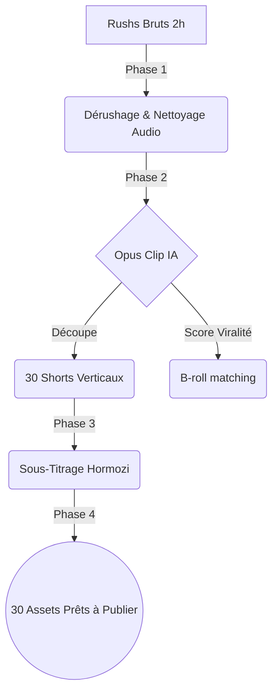

# Guide Formateur : DRIVE-TO-STORE VIRALE (Performance)
**Niveau 2 : L'Usine à Contenu par Intelligence Artificielle**

> [!IMPORTANT] 
> **DIRECTIVE TOP 1% :** Le client de l'offre "Drive-To-Store" est un artisan/commerçant surchargé. Ce Niveau 2 est magique pour lui car il s'agit d'une phase de **"Récolte"**. L'Agence utilise l'automatisation IA pour transformer le tournage du Niveau 1 en 30 actifs viraux. L'enjeu est de lui faire comprendre la puissance de l'IA (Opus Clip) afin de justifier le ticket d'entrée élevé, tout en conservant une fluidité "Plug & Play".

## Pipeline de Production IA (Asynchrone)

---

## ÉTAPE 1 : Processing Asynchrone des Rushs
*Durée: 30min | Valide : SKILL D2S-5*

**Actions Directives :**
- **Démonstration de Force Cloud :** Expliquez au client le transfert massif des fichiers lourds vers nos serveurs. Montrez-lui le logiciel de nettoyage audio (Adobe Podcast).
- **Catégorisation A-Roll / B-Roll :** Éduquez le client sur la différence entre "l'image principale où l'on parle" (A-roll) et "l'image de couverture d'action" (B-roll) qui garde le spectateur accroché.

---

## ÉTAPE 2 : Démonstration Opus Clip (Montage Spatial IA)
*Durée: 1h00 | Valide : SKILL D2S-6*

**Actions Directives :**
- **L'Effet "Wait & See" :** Partagez votre écran et montrez au client le LLM analyser sa vidéo de 2 heures. Regardez la machine découper, analyser et scorer mathématiquement la "viralité" des moments clés.
- **Tracking Vertical :** Prouvez la notion de "Face Tracking" : le cadrage IA suit le visage spécifiquement pour les formats TikTok/IG (9:16).

---

## ÉTAPE 3 : Sous-Titrage Dynamique & Effets (Hormozi)
*Durée: 45min | Valide : SKILL D2S-7*

**Actions Directives :**
- **Le Concept du "Zero-Audio" :** Rappelez la statistique : 80% des utilisateurs de réseaux sociaux scrollent dans les transports ou en réunion avec le son coupé.
- **Neuro-Design Appliqué :** Montrez la différence entre un sous-titre statique et un "Bouncy Text" avec couleurs claires et emojis forçant la mémorisation cognitive.

---

## ÉTAPE 4 : SEO Social & Méta-Données
*Durée: 45min | Valide : SKILL D2S-8*

**Actions Directives :**
- **L'Équation Géographique :** Formez le gérant au "Hacking" des hashtags géolocalisés. Plus la portée est locale, plus la conversion augmente.
- **Pack IA Sémantique :** Rédigez avec ChatGPT les descriptions (Captions) qui accompagneront chaque clip, avec du copywriting "Drive-To-Store".

---

## Ce que comprend la formation (Détail point par point)
*Récapitulatif contractuel des livrables techniques.*

- **Gestion Asynchrone des Assets :** Stockage sécurisé et catégorisation sémantique des rushs bruts. Nettoyage automatisé de la piste audio ("Studio Voice").
- **Découpe Algorithmique IA :** Processing Opus Clip pour générer 30 capsules courtes (Shorts/Reels) formatées en 9:16.
- **Motion Design Adaptatif :** Création et incrustation de "Bouncy Texts". Utilisation d'Emojis et coloration (Neuro-Copywriting) pour les vues Zero-Audio.
- **SEO Social :** Pack sémantique de +30 descriptions générées par l'IA. Ingénierie des Hashtags purement Locaux (#City #Neighborhood), CTA d'actions ciblées.

---

## Prestations "Done-For-You" (Back-Office Ingénierie)
*Ce que l'Agence produit entièrement à la place du client.*

- **Rendus Finaux (Batch Processing) :** Export brut des 30 vidéos prêtes à être ingérées dans les réseaux sociaux après traitement B-Roll additionnel (Masqué). Livraison Cloud des fichiers (Pack vidéo mensuel avec captions pré-attribuées).
- **Optimisation SEO & Sémantique :** Application des prompts Ultra-locaux (Masqués) sur les métadonnées TikTok.
