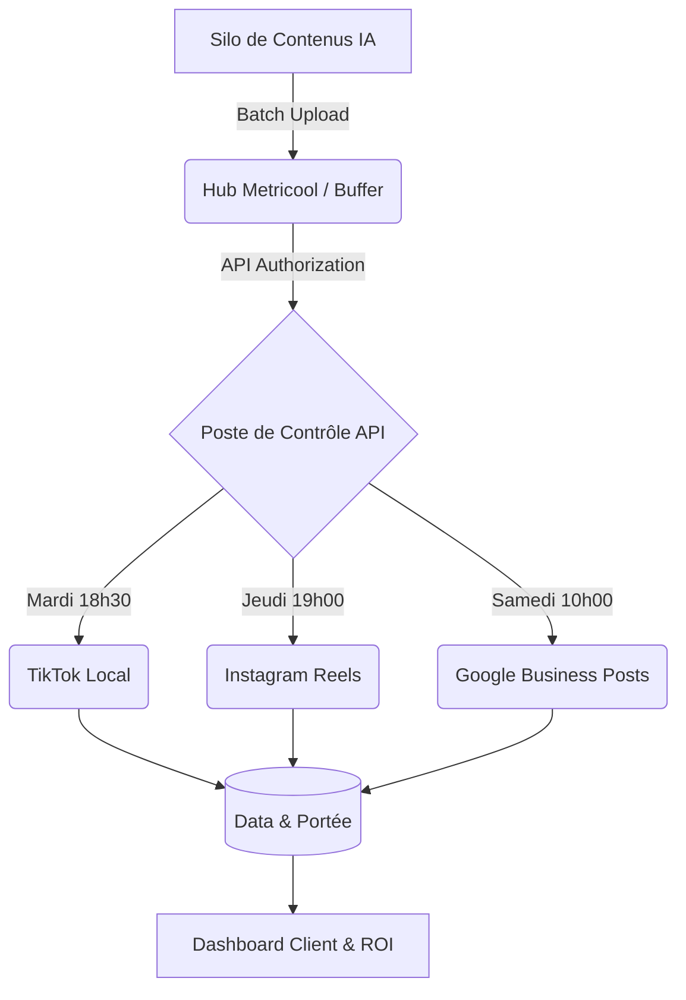

# Guide Formateur : DRIVE-TO-STORE VIRALE (Empire)
**Niveau 3 : Pilotage & Distribution Programmatique**

> [!IMPORTANT] 
> **DIRECTIVE TOP 1% :** Le Niveau 3 marque le point où la théorie se transforme en une machine de guerre automatisée. Après avoir filmé (Niveau 1) et monté (Niveau 2), il s'agit de **"Livrer"** à internet de façon agressive sans surcharger l'emploi du temps du client. L'attention doit donc se porter sur le transfert de charge (Metricool) et la métrique de succès (Trafic local vs Vanité).

## Architecture de Distribution Asynchrone

---

## ÉTAPE 1 : Connectivité API & Hub de Publication
*Durée: 45min | Valide : SKILL D2S-9*

**Actions Directives :**
- **Démystification de l'Omniprésence :** Brisez la croyance du client : "Je dois aller sur 3 applis différentes tous les matins". Présentez-lui Metricool/Buffer comme une "télécommande universelle".
- **Architecture de Liaison :** Effectuez (ou validez) l'authentification OAuth2 sécurisant le lien API entre son outil centralisé et les plateformes natives (TikTok/Instagram/Google).
- **Formatage Cross-Platform :** On publie la source vierge simultanément partout pour contourner les shadow-bans algorithmiques (par exemple, le filigrane TikTok sur Instagram).

---

## ÉTAPE 2 : Séquençage Temporel & Batching (90 Jours)
*Durée: 1h00 | Valide : SKILL D2S-10*

**Actions Directives :**
- **Analyse des Horaires de Pic :** Formez le client à lire les graphiques d'activité réseau. On poste prioritairement quand la cible locale est active (ex: 18h30 / 19h).
- **La Démonstration du "Barillet" :** Devant le client, montrez l'interface validant que l'ensemble des contenus (30 vidéos produites au Niveau 2) est bien étalé dynamiquement sur le calendrier trimestriel.

> [!TIP]
> **Angle Vente & Rétention :** "On charge le barillet ce matin. Et pendant les 3 prochains mois de votre vie, sans que vous n'ayez rien à toucher sur votre téléphone, votre marque fera parler d'elle trois fois par semaine sur internet."

---

## ÉTAPE 3 : Data Analytics & Passation (Hand-Off)
*Durée: 45min | Valide : SKILL D2S-11*

**Actions Directives :**
- **Détruire la Métrique de Vanité :** Apprenez au client à repérer les métadonnées inutiles mondiales et focalisez sa lecture sur le volume "Local", les clics vers le site et les itinéraires Maps générés.
- **Le Poste de Pilotage :** Effectuez la passation absolue. Validation formelle que le client a les clés d'administration de sa machine automatisée.

---

## Ce que comprend la formation (Détail point par point)
*Récapitulatif contractuel des livrables techniques.*

- **Hub de Publication Multi-Canal :** Connexion certifiée API (OAuth2) entre le Hub social et les plateformes natives (Meta/TikTok/Google). Configuration syndiquée.
- **Calendrier Programmatique (90 Jours) :** Analyse et sélection algorithmique des "heures chaudes" pour le marché local. Stratégie de Batching étalée sur le trimestre.
- **Reporting KPI :** Formation à l'identification de la donnée vitale (Clics vers adresse map, réservations effectives). Cession des accès de l'interface d'automatisation.

---

## Prestations "Done-For-You" (Back-Office Ingénierie)
*Ce que l'Agence produit entièrement à la place du client en coulisses.*

- **Déploiement Programmatique Complexe :** Temps d'ingénierie humain pour uploader méthodiquement les 30 vidéos produites par l'Intelligence Artificielle de l'Agence dans le Hub d'envoi. Couplage avec le paramétrage "Caption & SEO Local", validant le silencieux trimestriel.
- **Audit Sécurisation Comptes API :** Validation et monitoring des jetons de connexion entre Business Facebook et Instagram Pro pour anticiper et bloquer les désynchronisations techniques avant qu'elles ne coupent les envois de la machine.
